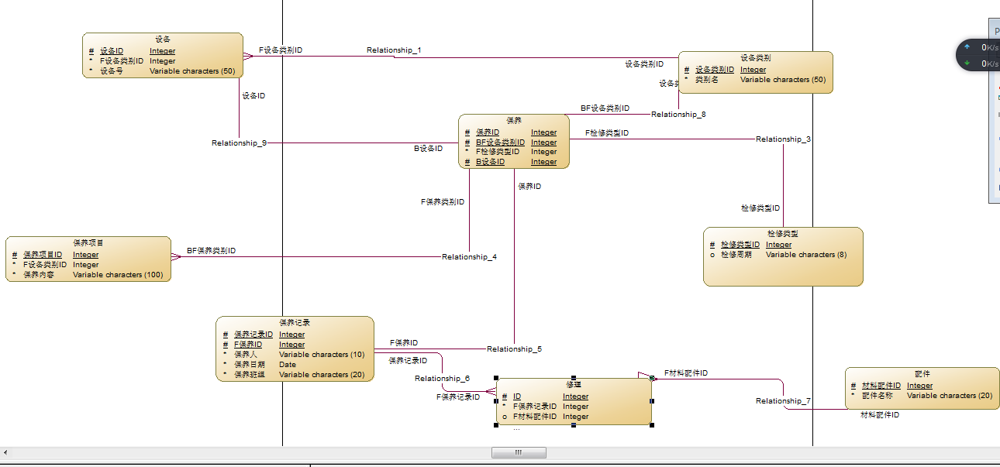
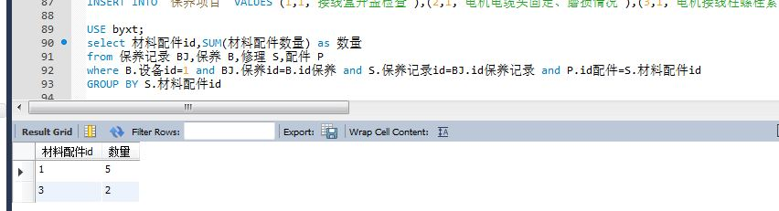
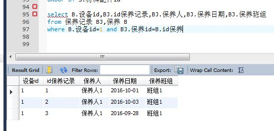
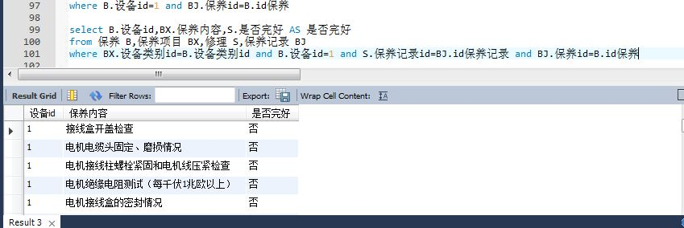

PowerDesigner

数据库语句：  
Create database byxt  
use byxt  

DROP TABLE IF EXISTS `保养`  

CREATE TABLE `设备类别` (  

  `id设备类别` int(11) NOT NULL,  
  
  `类别名` varchar(45) NOT NULL,  
  
  PRIMARY KEY (`id设备类别`),  
  
  UNIQUE KEY `类别名_UNIQUE` (`类别名`)  
  
)   

CREATE TABLE `设备` (  

  `id设备` int(11) NOT NULL,  
  
  `设备类别` int(11) NOT NULL,  
  
  `设备号` varchar(50) NOT NULL,  
  
  PRIMARY KEY (`id设备`),  
  
  KEY `设备类别_idx` (`设备类别`),   
  
  CONSTRAINT `FK1` FOREIGN KEY (`设备类别`)  
  REFERENCES `设备类别` (`id设备类别`) ON   
  
  DELETE NO ACTION ON UPDATE NO ACTION
)   

CREATE TABLE `检修类型` (  

  `id检修类型` int(11) NOT NULL,  
  
  `检修周期` int(11) NOT NULL,  
  
  PRIMARY KEY (`id检修类型`)  
  
)   

CREATE TABLE `保养` (  

  `id保养` int(11) NOT NULL,  
  
  `设备类别id` int(11) NOT NULL,  
  
  `设备id` int(11) NOT NULL,  
  
  `检修类型id` int(11) NOT NULL,  
  
  PRIMARY KEY  
  (`id保养`,`设备类别id`,`设备id`),  
  
  KEY `FK2_idx` (`设备类别id`),  
  
  KEY `FK3_idx` (`设备id`),  
  
  KEY `FK4_idx` (`检修类型id`),  
  
  CONSTRAINT `FK2` FOREIGN KEY  
  (`设备类别id`) REFERENCES `设备类别`  
  (`id设备类别`) ON DELETE NO ACTION ON  
  UPDATE NO ACTION,  
  
  CONSTRAINT `FK3` FOREIGN KEY (`设备id`)  
  REFERENCES `设备` (`id设备`) ON DELETE NO ACTION ON UPDATE NO ACTION,  
  
  CONSTRAINT `FK4` FOREIGN KEY  
  (`检修类型id`) REFERENCES `检修类型`  
  (`id检修类型`) ON DELETE NO ACTION ON  
  UPDATE NO ACTION
)  

CREATE TABLE `保养记录`   

(
  `id保养记录` int(11) NOT NULL,  
  
  `保养id` int(11) NOT NULL,  
  
  `保养人` varchar(10) NOT NULL,  
  
  `保养日期` date NOT NULL,  
  
  `保养班组` varchar(20) NOT NULL,  
  
  PRIMARY KEY (`id保养记录`,`保养id`),  
  
  KEY `FK7_idx` (`保养id`),  
  
  CONSTRAINT `FK7` FOREIGN KEY (`保养id`)  
  REFERENCES `保养` (`id保养`) ON DELETE NO ACTION ON UPDATE NO ACTION
)   

CREATE TABLE `保养项目` (  

  `id保养项目` int(11) NOT NULL,  
  
  `设备类别id` int(11) NOT NULL,  
  
  `保养内容` varchar(100) NOT NULL,  
  
  PRIMARY KEY (`id保养项目`),  
  
  KEY `FK6_idx` (`设备类别id`),  
  
  CONSTRAINT `FK6` FOREIGN KEY  
  (`设备类别id`) REFERENCES `设备类别`   
  
  (`id设备类别`) ON DELETE NO ACTION ON  
  UPDATE NO ACTION  
  
)  

CREATE TABLE `配件` (  

  `id配件` int(11) NOT NULL,  
  
  `配件名称` varchar(20) NOT NULL,  
  
  PRIMARY KEY (`id配件`)  
  
)   
CREATE TABLE `修理` (  

  `id修理` int(11) NOT NULL,  
  
  `保养记录id` int(11) NOT NULL,  
  
  `材料配件id` int(11) DEFAULT NULL,  
  
  `是否完好` varchar(2) NOT NULL,  
  
  `材料配件数量` varchar(45) DEFAULT NULL,  
  
  PRIMARY KEY (`id修理`),  
  
  KEY `FK8_idx` (`材料配件id`),  
  
  CONSTRAINT `FK10` FOREIGN KEY(`材料配件id`) REFERENCES `配件` (`id配件`) ON DELETE NO ACTION ON UPDATE NO ACTION
)  

INSERT INTO `修理` VALUES  
(1,1,1,'否','2'),(2,1,1,'否','3'),(3,1,3,'否','2'),(4,1,NULL,'是',NULL)

INSERT INTO `设备` VALUES (1,1,'001')  

INSERT INTO `保养` VALUES (1,1,1,5)  

INSERT INTO `检修类型` VALUES  
(1,365),(2,90),(3,60),(4,30),(5,7)  

INSERT INTO `设备类别` VALUES  
(2,'6000V以下不带振动电机'),  
(3,'6000V以下带振动电机'),  
(1,'6000V电机'),  
(4,'CST'),  
(5,'PLC')
INSERT INTO `配件` VALUES  
(1,'配件1'),  
(2,'配件2'),  
(3,'配件3'),  
(4,'配件4')
INSERT INTO `保养记录` VALUES  
(1,1,'保养人1','2016-10-01','班组1'),  
(2,1,'保养人1','2016-10-03','班组1'),  
(3,1,'保养人1','2016-09-28','班组1')  

INSERT INTO `保养项目` VALUES  
(1,1,'接线盒开盖检查'),  
(2,1,'电机电缆头固定、磨损情况'),  
(3,1,'电机接线柱螺栓紧固和电机线压紧检查'),  
(4,1,'电机绝缘电阻测试（每千伏1兆欧以上）'),  
(5,1,'电机接线盒的密封情况'),(6,1,'电机接地线连接是否可靠'),  
(7,1,'电机上是否有杂物，多要通知工艺处理')  

查询语句：  

查询设备编号为1的材料消耗情况  

USE byxt;  

select &nbsp;&nbsp;材料配件&nbsp;&nbsp;id,SUM(材料配件数量) as 数量   

from &nbsp;&nbsp;保养记录&nbsp;&nbsp; BJ,保养 &nbsp;&nbsp;B,修理&nbsp;&nbsp; S,配件&nbsp;&nbsp; P   

where B.设备&nbsp;id=1 &nbsp;&nbsp;and&nbsp;&nbsp; BJ.保养&nbsp;&nbsp;id=B.&nbsp;&nbsp;id&nbsp;保养  
and &nbsp;&nbsp;S.保养记录&nbsp;&nbsp;id=BJ.id&nbsp;&nbsp;保养记录 &nbsp;&nbsp;  
and &nbsp;&nbsp;P.id配件=S.材料配件&nbsp;&nbsp;id  

GROUP&nbsp;&nbsp; BY&nbsp;&nbsp; S.材料配件&nbsp;&nbsp;id  

select&nbsp;&nbsp; B.设备&nbsp;&nbsp;id,BJ.id&nbsp;&nbsp;保养记录,  
BJ.保养人,  
BJ.保养日期,  
BJ.保养班组
from 保养记录 BJ,保养 B  

where&nbsp;&nbsp; B.设备id=1 and  
BJ.保养id=B.id保养  

  

select &nbsp;&nbsp;B.设备id,BX.保养内容,S.是否完好  
AS 是否完好  

from 保养 B,  
保养项目 BX,  
修理 S,  
保养记录 BJ  

where &nbsp;BX.设备类别id=B.设备类别id  
and B.设备id=1   
and S.保养记录id=BJ.id保养记录   
and BJ.保养id=B.id保养  

  

select &nbsp;SB.设备号  

from &nbsp;设备 SB,  
检修类型 JX,  
(select &nbsp;B.设备id as id,  
max(BJ.保养日期)   
as &nbsp;timee&nbsp;  
from 保养记录 BJ,  
保养 B group by B.设备id)  
AS T  

where T.id=SB.id设备   
and JX.检修周期-DATEDIFF(now(),T.timee)<4  

select&nbsp; DATEDIFF(now(),T.timee)  

from (select &nbsp;B.设备id   
as &nbsp;id,  
max(BJ.保养日期)   
as&nbsp; timee &nbsp;  
from 保养记录 BJ,  
保养 B   
group by B.设备id)   
AS T

